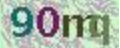
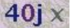

# Captcha-dataset: one captcha dataset for tensorflow/torch7/keras/caffe2 一个验证码的数据集


Sample:






Data:

```
tar -ezf yzm.tar.gz
tar -ezf yzm1.tar.gz
mv yzm1/* yzm/
```

(Because of github's 100MB limitation)


**9272 in total, made by human labeling, accuracy > 98%**

Label file is `yzm_labels.txt`


Useful Res:

Related repo [decaptcha](https://github.com/fateleak/decaptcha)

tensorflow共享群(625706505)：


